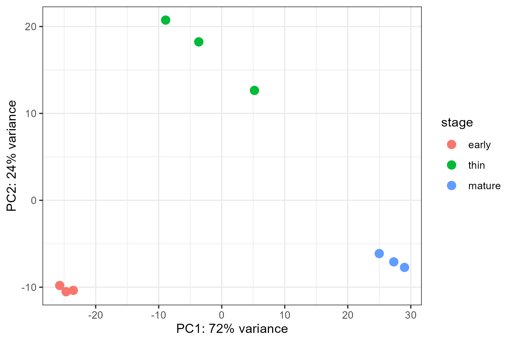
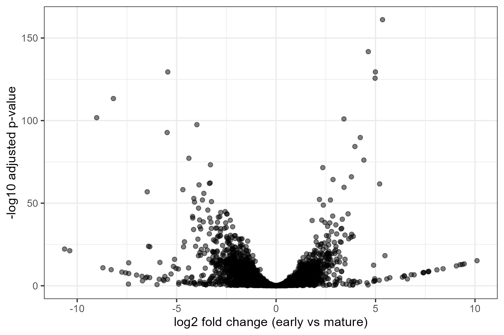
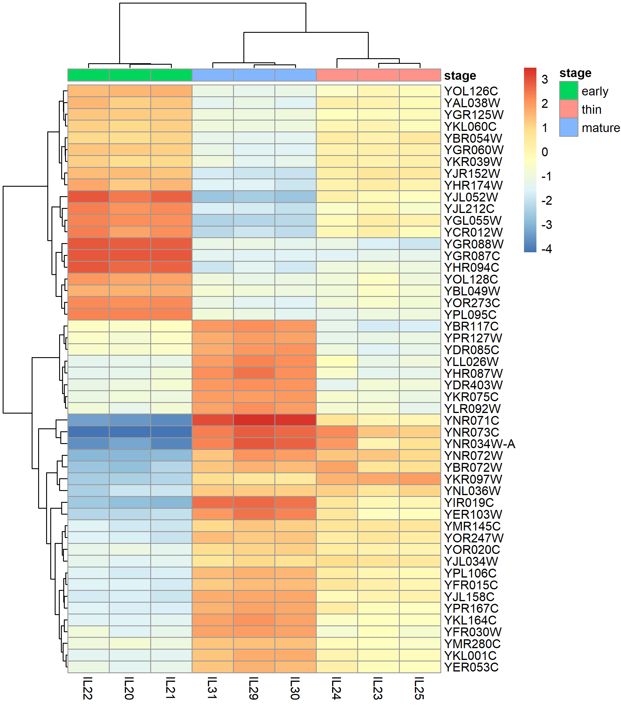
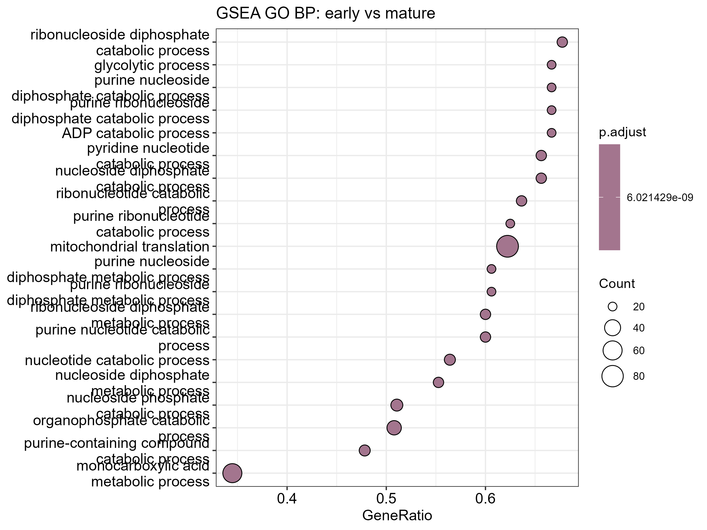
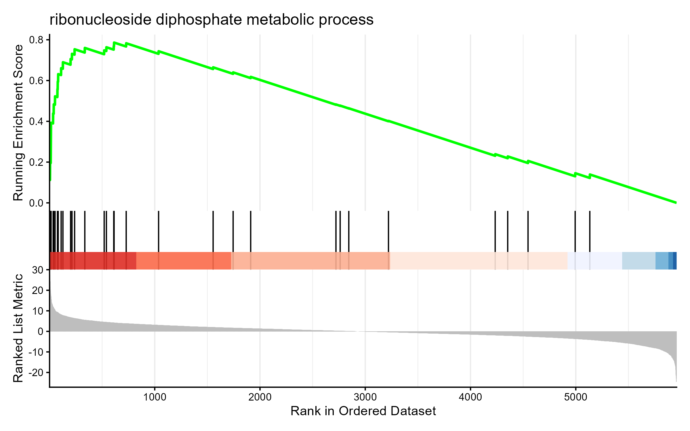
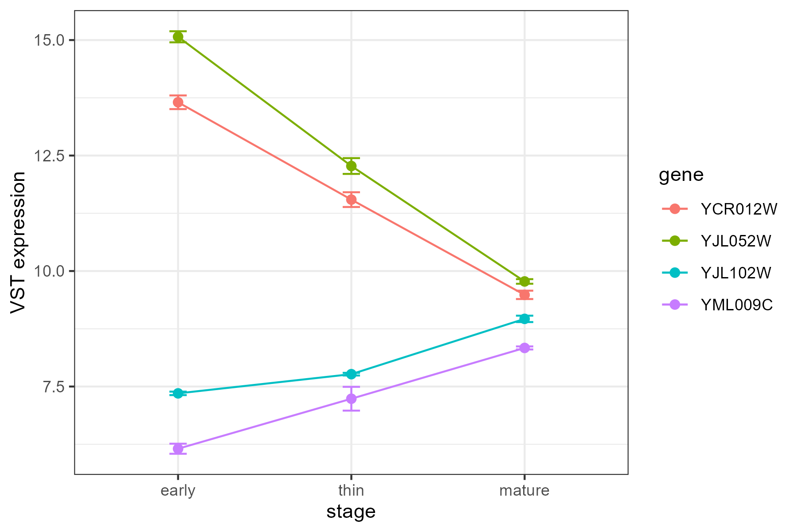

# Assignment 2 — Bulk RNA-seq differential expression and functional analysis on Yeast biofilm

**Introduction**

In wine aging, a specialized flor yeast biofilm (velum) forms on the wine surface and is described as a key adaptive trait that supports survival under harsh conditions while shaping oxidative wine chemistry (Mardanov et al. 2020). These microbial biofilms are structured communities that exhibit phenotypes distinct from free-living cells and are associated with broad transcriptional reprogramming during development in Saccharomyces cerevisiae (Li et al. 2015). Prior RNA-seq studies spanning multiple biofilm periods report thousands of differentially expressed genes across development and highlight that biofilm formation involves coordinated metabolic and regulatory shifts (Li et al. 2015; Mardanov et al. 2020).

This project analyzes differential gene expression among early, thin, and mature velum stages in the Mardanov et al. dataset downstream functional interpretation to summarize biological themes associated with biofilm development. Read-level quality assessment and cross-sample QC summarization was performed using commonly used tools FastQC (Andrews, 2010\) and MultiQC (Ewels et al. 2016\) as a preliminary step. A selection-aware approach through Salmon (Patro et al. 2017\) was chosen for quantification, considering the tradeoff in speed and accuracy between lightweight approaches and traditional alignment (Srivastava et al. 2020). Differential expression analysis was performed with DESeq2, a widely used choice with an overall strong performance and suitability for analysis of a lower number of replicates (Schurch et al. 2016). For functional interpretation, the Gene Set Enrichment Analysis (GSEA) method (Korotkevich et al. 2016\) was chosen over Overrepresentation analysis (ORA) to reduce dependence on an arbitrary significance cutoff. This decision was backed by literature that distinguishes ORA’s thresholded gene-list dependence from GSEA’s ranked-list framework (Geistlinger et al. 2021), with reports of functional class scoring (FCS) methods like GSEA being observed to exhibit superior sensitivity when detecting subtle associations (Wijesooriya et al. 2022).

**Methods** 

All terminal commands and R analysis code are provided in the project repository, within the “scripts” section. 

RNA-seq data for flor yeast velum development (early, thin, mature; n \= 3 per stage) were obtained from the published dataset source study (Mardanov et al., 2020). SRA runs were downloaded and converted to FASTQ using SRA Toolkit. The \--split-files option was included as an additional sanity check that the downloaded runs matched the expected library layout reported in the study (50-bp single-end reads). Read quality was assessed per-sample using FastQC(v0.12.1) and summarized across all samples using MultiQC(v1.33).

Transcript abundances were quantified with Salmon (v1.10.3). The reference transcriptome was downloaded directly from NCBI (r64). Because reads were single-end, fragment length parameters needed to be provided. Salmon single-end defaults were used (--fldMean 250, \--fldSD 25). Transcript-level estimates were imported and summarized to gene-level counts with tximport, then analyzed in DESeq2 with stage as the main factor. Pairwise contrasts (early vs thin, thin vs mature, early vs mature) were tested; the early vs mature contrast showed the largest shift and was prioritized for downstream interpretation.

Gene set enrichment analysis (GSEA) was conducted using clusterProfiler (Wu et al. 2021\) on Gene Ontology (GO) Biological Process (BP) gene sets. Gene to GO mappings were obtained from org.Sc.sgd.db (Bioconductor S. cerevisiae annotation package derived from SGD/GO), without filtering by evidence code. Key GSEA analytical choices reported as recommended by Wijesooriya et al. (2022) are as follows: (i) gene weighting parameter \= 1 (default), (ii) a gene-permutation testing approach, and (iii) ranking by the DESeq2 Wald statistic.

**Results**

RNA-seq libraries from three velum developmental stages: early, thin, mature ( *n* \= 3 per stage) were quantified and summarized to gene-level counts for differential expression (DE) analysis.

Variance-stabilized expression values showed strong stage-associated structure. In performing PCA, it was observed that samples clustered by stage, with **PC1** explaining **72%** and **PC2** explaining **24%** of the variance. Early and mature samples were clearly separated along PC1, while thin samples formed a distinct cluster intermediate along PC1 but separated along PC2, consistent with a progressive transcriptome shift across development of biofilm (Figure 1).

*Figure 1. PCA of VST-transformed gene expression by stage.* PCA was computed on VST-transformed DESeq2 expression values and colored by stage. Points represent individual samples. Replicates from the same stage cluster more closely to one another than to other stages, with thin samples intermediate between early and mature along PC1.

**Differential expression across stages**

DESeq2 identified widespread differential expression across all contrasts (FDR \< 0.05), with the largest number and strongest effect sizes in early vs mature. Using a more stringent subset (**FDR \< 0.05 and |log2FC| ≥ 1**), early vs mature still retained the most DE genes, consistent with the greatest transcriptional remodeling occurring between the earliest and latest stages of velum biofilm development. The results for each contrast are summarized in Table 1\.

**Table 1\. Differential expression summary by contrast**

|  contrast | Number of genes tested | Number of genes with  FDR \< 0.05 | Number of genes with  FDR \< 0.05 and |log2FC| ≥ 1 | med\_absLFC\_sig  (rounded to 3 decimal places) |
| :---- | ----- | ----- | ----- | ----- |
| early vs thin   | 5957 | 2194 | 1119 | 1.009 |
| thin vs mature | 5957 | 2352 | 1320 | 1.059 |
| early vs mature | 5957 | 2968 | 1866 | 1.193 |

To visualize the distribution of effect sizes and statistical support in the early vs mature contrast, a volcano plot was generated (Figure 2). A heatmap of the 50 most significant genes by adjusted p-value further highlights coordinated, stage-associated expression patterns across samples (Figure 3).

*Figure 2. Volcano plot for early vs mature differential expression.* Each point represents a gene; the x-axis shows log2 fold change (early vs mature) and the y-axis shows −log10(FDR). Broad differential expression is observed in both directions, with many genes remaining significant after multiple-testing correction.

*Figure 3. Heatmap of the top 50 DE genes in the early vs mature contrast.* Heatmap shows VST expression centered per gene for the 50 lowest-FDR genes. Columns are annotated by stage. Early samples cluster together and are distinct from mature samples, while thin samples form a separate group with intermediate profiles across many genes.

**Functional shifts captured by GSEA (GO Biological Process; early vs mature)**

Multiple metabolic and nucleotide-related categories showed strong **positive enrichment (NES \> 0\)**, indicating their member genes were concentrated toward the “early-high” end of the ranked list. In contrast, translation/mitochondria-associated categories showed **negative enrichment (NES \< 0\)**, indicating their genes were concentrated toward the “mature-high” end (Figure 4).

Two representative, highly significant terms were:

* **GO:0009185 – ribonucleoside diphosphate metabolic process**: NES \= **2.756**, FDR (**p.adjust**) \= **6.02×10⁻⁹**, leading-edge **21/35 genes** (GeneRatio \= **0.60**)

* **GO:0032543 – mitochondrial translation**: NES \= **−2.531**, FDR (**p.adjust**) \= **6.02×10⁻⁹**, leading-edge **84/135 genes** (GeneRatio \= **0.62**)

*Figure 4. GSEA dotplot (GO BP) for early vs mature.* The dotplot displays the top enriched terms from GSEA. Dot color encodes adjusted p-value (FDR) and dot size encodes Count (leading-edge genes contributing most to enrichment). The x-axis shows GeneRatio, reflecting the proportion of leading-edge genes within each gene set.

The enrichment curve for the top term (GO:0009185) shows a strong positive running enrichment score early in the ranked list, consistent with many leading-edge genes appearing among the most early-upregulated signals (Figure 5).

*Figure 5. Enrichment plot for GO:0009185 (ribonucleoside diphosphate metabolic process).* The running enrichment score (ES) is shown as the ranked gene list is traversed from left (top-ranked genes) to right (bottom-ranked genes). Vertical ticks indicate positions of GO-term genes within the ranked list. The bottom panel shows the distribution of the ranking metric (DESeq2 Wald statistic). A strong early peak indicates enrichment toward the early-high end of the ranking.

**Genes linking GSEA terms to expression**

Two DE genes were chosen from top positively and negatively enriched GO terms were chosen for visualization and to explore biological significance. Representative “leading-edge” genes from the positively enriched metabolic term showed decreasing expression from early → thin → mature, consistent with positive early vs mature log2 fold changes both decline across stages.

Conversely, representative leading-edge genes from the negatively enriched mitochondrial translation term increased across development, consistent with negative log2 fold changes being higher in mature (Figure 6).

*Figure 6. VST expression trajectories for selected leading-edge genes across stages.* Stage trajectories are shown for four selected ORFs (YJL052W, YCR012W, YJL102W, YML009C). Points represent mean VST expression across replicates within each stage; error bars represent standard error of the mean (SE = sd/√n) computed within stage.

**Discussion**

The results of this analysis indicate coordinated changes in functional modules rather than isolated gene-level effects. Principal component analysis and differential expression clearly distinguished early and mature velum transcriptomes, with thin samples occupying an intermediate position. This overall structure is consistent with the staged velum sampling and developmental progression described in Mardanov et al. (2020).

In the early versus mature comparison, glycolysis- and nucleotide/sugar metabolism–associated genes were enriched toward the early-upregulated end of the ranked list. This pattern is reflected at the gene level by higher early-stage expression of **TDH1 (YJL052W)** and **PGK1 (YCR012W)**, which encode core glycolytic enzymes involved in glycolysis/gluconeogenesis: TDH1 encodes for Glyceraldehyde-3-phosphate dehydrogenase (Linck et al. 2014\) and PGK1 for 3-phosphoglycerate kinase (Lam and Marmur 1977\). Notably, this directionality aligns with the original dataset study: Mardanov et al. report strong downregulation of glycolysis enzymes including **PGK1** and **TDH1**, and further note that expression of most glycolytic genes decreases during velum development, which is consistent with glucose exhaustion and a metabolic shift away from fermentative glycolysis.

In contrast, genes associated with mitochondrial translation were enriched toward the mature-upregulated end of the ranked list, consistent with higher mature-stage expression of **MEF2 (YJL102W)**, a mitochondrial translation factor, and **MRPL39 (YML009C)**, a mitochondrial large-subunit ribosomal protein. Together, these results indicate stage-associated differences in the relative representation of glycolytic versus mitochondrial translation transcripts across velum development.

These findings should be interpreted within the limitations of bulk RNA-seq. Transcript abundance does not necessarily reflect protein abundance or enzymatic activity (Vogel and Marcotte 2012), and GO categories are hierarchical and partially overlapping (Ashburner et al. 2000). Future work incorporating proteomic or metabolomic profiling, as well as more detailed time-series analysis of intermediate stages, could further clarify the biological implications of these transcriptional patterns.

**References:**

Andrews, S. (2010). FastQC a quality control tool for high throughput sequence data. Babraham.ac.uk.    https://www.bioinformatics.babraham.ac.uk/projects/fastqc/

Ashburner, Michael, Catherine A. Ball, Judith A. Blake, David Botstein, Heather Butler, J. Michael Cherry, Allan P. Davis, Kara Dolinski, Selina S. Dwight, Janan T. Eppig, Midori A. Harris, David P. Hill, Laurie Issel-Tarver, Andrew Kasarskis, Suzanna Lewis, John C. Matese, Joel E. Richardson, Martin Ringwald, Gerald M. Rubin, and Gavin Sherlock. 2000\. “Gene Ontology: Tool for the Unification of Biology.” *Nature Genetics* 25(1):25–29. doi:10.1038/75556. 

Ewels, Philip, Måns Magnusson, Sverker Lundin, and Max Käller. 2016\. “MultiQC: Summarize Analysis Results for Multiple Tools and Samples in a Single Report.” *Bioinformatics* 32(19):3047–48. doi:10.1093/bioinformatics/btw354. 

Geistlinger, Ludwig, Gergely Csaba, Mara Santarelli, Marcel Ramos, Lucas Schiffer, Nitesh Turaga, Charity Law, Sean Davis, Vincent Carey, Martin Morgan, Ralf Zimmer, and Levi Waldron. 2021\. “Toward a Gold Standard for Benchmarking Gene Set Enrichment Analysis.” *Briefings in Bioinformatics* 22(1):545–56. doi:10.1093/bib/bbz158. 

Korotkevich, Gennady, Vladimir Sukhov, Nikolay Budin, Boris Shpak, Maxim N. Artyomov, and Alexey Sergushichev. 2016\. “Fast Gene Set Enrichment Analysis.” 

Lam, K. B., and J. Marmur. 1977\. “Isolation and Characterization of Saccharomyces Cerevisiae Glycolytic Pathway Mutants.” *Journal of Bacteriology* 130(2):746–49. doi:10.1128/jb.130.2.746-749.1977. 

Li, Zhenjian, Yong Chen, Dong Liu, Nan Zhao, Hao Cheng, Hengfei Ren, Ting Guo, Huanqing Niu, Wei Zhuang, Jinglan Wu, and Hanjie Ying. 2015\. “Involvement of Glycolysis/Gluconeogenesis and Signaling Regulatory Pathways in Saccharomyces Cerevisiae Biofilms during Fermentation.” *Frontiers in Microbiology* 6\. doi:10.3389/fmicb.2015.00139. 

Linck, Annabell, Xuan-Khang Vu, Christine Essl, Charlotte Hiesl, Eckhard Boles, and Mislav Oreb. 2014\. “On the Role of GAPDH Isoenzymes during Pentose Fermentation in Engineered *Saccharomyces Cerevisiae*.” *FEMS Yeast Research* 14(3):389–98. doi:10.1111/1567-1364.12137. 

Mardanov, Andrey V., Mikhail A. Eldarov, Alexey V. Beletsky, Tatiana N. Tanashchuk, Svetlana A. Kishkovskaya, and Nikolai V. Ravin. 2020\. “Transcriptome Profile of Yeast Strain Used for Biological Wine Aging Revealed Dynamic Changes of Gene Expression in Course of Flor Development.” *Frontiers in Microbiology* 11:538. doi:10.3389/fmicb.2020.00538. 

Patro, Rob, Geet Duggal, Michael I. Love, Rafael A. Irizarry, and Carl Kingsford. 2017\. “Salmon Provides Fast and Bias-Aware Quantification of Transcript Expression.” *Nature Methods* 14(4):417–19. doi:10.1038/nmeth.4197. 

Schurch, Nicholas J., Pietá Schofield, Marek Gierliński, Christian Cole, Alexander Sherstnev, Vijender Singh, Nicola Wrobel, Karim Gharbi, Gordon G. Simpson, Tom Owen-Hughes, Mark Blaxter, and Geoffrey J. Barton. 2016\. “How Many Biological Replicates Are Needed in an RNA-Seq Experiment and Which Differential Expression Tool Should You Use?” *RNA* 22(6):839–51. doi:10.1261/rna.053959.115. 

Srivastava, Avi, Laraib Malik, Hirak Sarkar, Mohsen Zakeri, Fatemeh Almodaresi, Charlotte Soneson, Michael I. Love, Carl Kingsford, and Rob Patro. 2020\. “Alignment and Mapping Methodology Influence Transcript Abundance Estimation.” *Genome Biology* 21(1):239. doi:10.1186/s13059-020-02151-8. 

Vogel, Christine, and Edward M. Marcotte. 2012\. “Insights into the Regulation of Protein Abundance from Proteomic and Transcriptomic Analyses.” *Nature Reviews Genetics* 13(4):227–32. doi:10.1038/nrg3185. 

Wijesooriya, Kaumadi, Sameer A. Jadaan, Kaushalya L. Perera, Tanuveer Kaur, and Mark Ziemann. 2022\. “Urgent Need for Consistent Standards in Functional Enrichment Analysis” edited by M. L. Kemp. *PLOS Computational Biology* 18(3):e1009935. doi:10.1371/journal.pcbi.1009935. 

Wu, Tianzhi, Erqiang Hu, Shuangbin Xu, Meijun Chen, Pingfan Guo, Zehan Dai, Tingze Feng, Lang Zhou, Wenli Tang, Li Zhan, Xiaocong Fu, Shanshan Liu, Xiaochen Bo, and Guangchuang Yu. 2021\. “clusterProfiler 4.0: A Universal Enrichment Tool for Interpreting Omics Data.” *The Innovation* 2(3):100141. doi:10.1016/j.xinn.2021.100141. 
